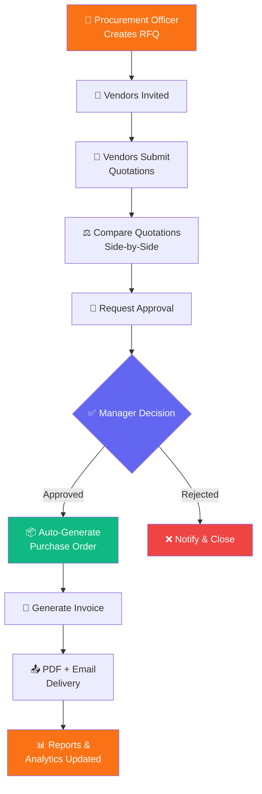

<div align="center">
  

  # VendorBridge
  ### Enterprise Procurement & Vendor Management ERP

  <p>Everything your procurement team needs to source, approve, and pay — all in one modern workspace.</p>

  
  
  
  
  

  [🚀 Live Demo](https://vendorbridge.vercel.app) · [📖 Documentation](#documentation) · [🐛 Report Bug](https://github.com/issues) · [✨ Request Feature](https://github.com/issues)
</div>

---

## 🎯 About VendorBridge

VendorBridge is a **production-grade Procurement & Vendor Management ERP** built for modern enterprises. It digitizes the entire procurement lifecycle — from vendor onboarding to invoice settlement — eliminating manual inefficiencies and enabling structured, trackable workflows.

### The Problem
Most organizations still manage procurement through WhatsApp, Excel sheets, and email chains:
- 📉 Lost quotations and missed deadlines
- 🔍 Zero visibility into spending patterns
- ⏳ Delayed approvals and untracked purchase orders
- 📊 No analytics on vendor performance

### The Solution
VendorBridge provides a **centralized, role-based ERP** that handles the complete procurement lifecycle with real-time tracking, automated document generation, and actionable analytics.

---

## 🔄 Procurement Workflow



---

## ✨ Key Features

| Module | Description |
|--------|-------------|
| 🔐 **Authentication** | Email/Password + Google OAuth, role-based redirects, session handling |
| 📊 **Dashboard** | Live KPIs, procurement health score, spend charts, activity feed |
| 🏭 **Vendor Management** | Full profiles with GST, bank details, performance scoring |
| 📋 **RFQ Management** | 3-step wizard, dynamic products, vendor assignment, deadline tracking |
| 💬 **Quotations** | Line-item pricing, auto-calculations, draft/submit workflow |
| ⚖️ **Comparison Engine** | Side-by-side view, smart scoring (price + delivery + rating) |
| ✅ **Approval Workflow** | Role-based approvals, remarks, auto PO on approval |
| 📦 **Purchase Orders** | Auto PO numbers (PO-2026-XXXX), PDF export, status tracking |
| 🧾 **Invoices** | Professional layout, PDF/Print, email delivery, payment tracking |
| 📈 **Reports** | 4 Recharts, date ranges, CSV export, vendor performance metrics |
| 📝 **Activity Logs** | Full audit trail, filterable timeline, real-time updates |

---

## 🎭 Role-Based Access Control

| Feature | Admin | Manager | Procurement Officer | Vendor |
|---------|-------|---------|---------------------|--------|
| Dashboard | ✅ Full | ✅ Full | ✅ Full | ❌ |
| Vendor Management | ✅ Full | 👁️ View | ✅ Full | ❌ |
| RFQ Management | ✅ Full | 👁️ View | ✅ Full | 👁️ View |
| Quotations | ✅ Full | 👁️ View | ✅ Full | ✅ Full |
| Approvals | ✅ Full | ✅ Full | 👁️ View | ❌ |
| Purchase Orders | ✅ Full | 👁️ View | ✅ Full | 👁️ View |
| Invoices | ✅ Full | 👁️ View | ✅ Full | 👁️ View |
| Reports & Analytics | ✅ Full | ✅ Full | 👁️ View | ❌ |

> ✅ Full Access &nbsp;&nbsp; 👁️ View Only &nbsp;&nbsp; ❌ No Access

---

## 🛠️ Tech Stack

<table>
<tr>
<td valign="top" width="33%">

**🖥️ Frontend**
- Next.js 14 (App Router)
- TypeScript (Strict)
- Tailwind CSS
- shadcn/ui Components
- Recharts
- Zustand
- React Hook Form + Zod

</td>
<td valign="top" width="33%">

**⚙️ Backend**
- Next.js API Routes
- `/api/send-invoice`
- `/api/generate-po-number`
- `/api/generate-invoice-number`
- Middleware (RBAC Guards)
- Firestore Security Rules

</td>
<td valign="top" width="33%">

**☁️ Services**
- Firebase Auth
- Firestore Database
- Resend (Email)
- jsPDF (Documents)
- Vercel (Deployment)

</td>
</tr>
</table>

### Tech Badges


---

## 📁 Project Structure

```text
vendorbridge/
├── app/
│   ├── (auth)/
│   │   ├── login/                 # Premium split-screen login
│   │   ├── register/              # Multi-field registration
│   │   └── complete-profile/      # Google OAuth completion
│   ├── (dashboard)/
│   │   ├── layout.tsx             # Sidebar + header shell
│   │   ├── dashboard/             # KPIs, charts, activity
│   │   ├── vendors/               # Vendor CRUD + performance
│   │   ├── rfqs/                  # RFQ wizard + management
│   │   ├── quotations/            # Quote submission + comparison
│   │   ├── approvals/             # Approval workflow
│   │   ├── purchase-orders/       # PO management + PDF
│   │   ├── invoices/              # Invoice + email + PDF
│   │   ├── activity/              # Audit trail
│   │   └── reports/               # Analytics dashboard
│   └── api/
│       ├── send-invoice/          # Resend email integration
│       ├── generate-po-number/    # Atomic PO counter
│       └── generate-invoice-number/
├── components/
│   ├── ui/                        # shadcn/ui + Logo
│   ├── auth/                      # Auth + Google button
│   └── shared/                    # Shared components
├── lib/
│   ├── firebase.ts                # Firebase config
│   ├── permissions.ts             # RBAC logic
│   ├── formatCurrency.ts          # Lakh/Crore formatting
│   ├── seedData.ts                # 12-month demo seeder
│   └── logActivity.ts             # Activity logger
├── store/
│   └── authStore.ts               # Zustand global state
├── firestore.rules                # Security rules
├── .env.local.example             # Env template
└── README.md
```

---

## 🚀 Getting Started

### Prerequisites
- Node.js 18+
- npm or yarn
- Firebase project ([console.firebase.google.com](https://console.firebase.google.com))

### Installation

```bash
# Clone the repository
git clone https://github.com/YOUR_USERNAME/vendorbridge.git
cd vendorbridge

# Install dependencies
npm install

# Setup environment
cp .env.local.example .env.local
# Fill in your Firebase keys in .env.local
```

### Firebase Setup

1. Create Firebase project → Enable **Email/Password** + **Google** auth
2. Create Firestore database in **asia-south1** region
3. Deploy security rules:

```bash
npm install -g firebase-tools
firebase login
firebase use --add
firebase deploy --only firestore:rules
```

### Run Development

```bash
npm run dev
# http://localhost:3000
```

### Build & Deploy

```bash
# Test production build
npm run build

# Deploy to Vercel
vercel --prod
```

---

## 📦 Deploy to Vercel

[](https://vercel.com/new/clone?repository-url=https://github.com/YOUR_USERNAME/vendorbridge)

1. Push code to GitHub
2. Import on [vercel.com](https://vercel.com)
3. Add environment variables from `.env.local.example`
4. Deploy 🚀

---

## 🌱 Demo Data

VendorBridge ships with a realistic **12-month procurement dataset**:

| Data Type | Count | Details |
|-----------|-------|---------|
| 🏭 Vendors | 15 | Across 10+ categories with GST + bank details |
| 📋 RFQs | 12 | Jan 2025 – Jun 2026 |
| 💬 Quotations | 30+ | With competitive pricing |
| 📦 Purchase Orders | 10 | Total value ₹1.6+ Cr |
| 📝 Activity Logs | 50+ | Across all modules |

> Load demo data from the Dashboard banner on first sign-in.

---

## 🤝 Contributing

1. Fork the project
2. Create feature branch: `git checkout -b feature/AmazingFeature`
3. Commit: `git commit -m 'Add AmazingFeature'`
4. Push: `git push origin feature/AmazingFeature`
5. Open a Pull Request

---

## 📄 License

MIT License — see [LICENSE](LICENSE) for details.

---

<div align="center">

**Built with ❤️ for Odoo x GCET Hackathon 2026**

⭐ Star this repo if you found it helpful!

</div>
